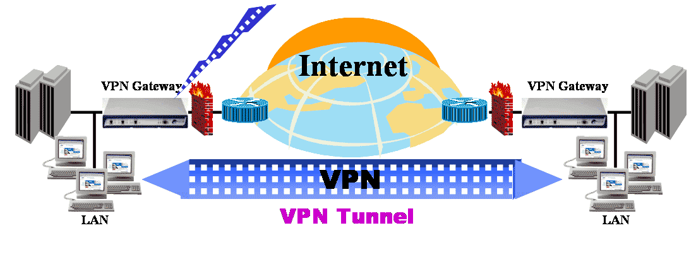
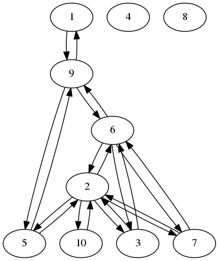
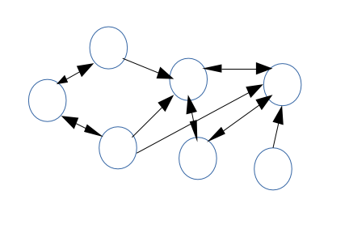

.. Secure Peer Networking with TINC slides file, created by
   hieroglyph-quickstart on Sun Nov 15 21:40:13 2015.

================================
Secure Peer Networking with TINC
================================

Spencer Krum

IBM

@nibalizer

nibz@spencerkrum.com

.. note::

   * Who am I
   * What do I work on
   * github

Logos
=====

.. note::

   * I've wanted to give this talk for a long time
   * This is a talk about tinc
   * A little about consul

Tinc is a VPN
=============

.. note::
    * Mesh VPN
    * Different than point-to-point VPNs like OpenVPN

Tinc Fast Facts
===============

.. note::

    * Written in C
    * Started in 1998, first commited to src in 2000
    * Portable (\*nix, Windows, Android, IOS incoming)
    * Daemon
    * 99% 2 Developers
    * 15 % link speed slowdown in the cloud
    * Port 655 in /etc/services
    * freenode channel

The Network
===========

.. note::

    * Use this with my friends
      ** not prod lol
    * Bringing back the network
    * University Network
    * LAN Parties
    * Services
    * Blurry line between workstation and server
    * we run it on laptops and home routers and the occasional rackmount gear

VPN & Network
=============

.. note::

  * this pic Generated every minute
  * Flat IP space
  * Daemon = node
  * Each daemon responsible for a subnet and an ip addr
  * Continually probes for most efficient routes
  * Re-routes around failures

VPN & Network
=============

.. note::

   * tinc has a concept of 'connect to'
   * Connections don't have to be reflexive
   * Netwokr trafic is bidirectional regardless
   * These nodes are laptops or servers or home routers
   * basically comes down to which nodes have a known public ip
   * public/private keys

Getting Status
==============

.. code-block:: bash
   :emphasize-lines: 3,7

   Edges:
     bkero to spencer at 131.xxx.xx.xx  weight 1538
     spencer to bkero at 216.xxx.xx.xx  weight 1538
   End of edges.
   Subnet list:
     10.11.11.128/25#10 owner spencer
     10.11.22.0/24#10 owner bkero
   End of subnet list.

Tincd
=====

* Very similar to other services
* Config files in /etc/tinc/$NET
* First run, generate pubkey/privkey: tincd -K -n $NET
* tincd -n $NET --no-detach
* Fun with Signals!

Features
========

* Security (auto-rekeying)
* Convenience
  * New host discovery
  * Auto-rekeying
  * Autoreconnect after network blip
  * Packet buffering means reconnects are transparent
  * This means SSH connections don't DC when laptop sleeps
  * Laptop has permanent IP address

Installation - Install the package
==================================

* TODO (Diagram of distro logos)
* Install the package (tinc)

Installation - Make config files
================================

* mkdir /etc/tinc/$NETWORK for config files
* mkdir /etc/tinc/$NETWORK/hosts to list hosts
* edit /etc/tinc/$NETWORK/tinc.conf
* (Code-block for tinc.conf)

.. code-block:: bash
   :emphasize-lines 2

   $ cat /etc/tinc/examplenet/tinc.conf
   Name = laptop
   AddressFamily = ipv4

Installation - Connect to Node (Optional)
=========================================

* Add a host to connect to (codeblock for host config file)

Is it working?
==============

* Start up tincd with --no-detach
* Signals!
  * SIGHUP - Reread config file, open/close connections
  * ALRM - Reconnect to all hosts
  * INT (^c) - Increase debug level to 5, again to revert
  * USR1 - Prints connection list
  * USR2 - Prints all the info
* Tincstat (github.com/nibalizer/tincstat)

Security
========

* TODO (Picture of big padlock)
* TODO (Add more content)
* Transitive trust - everybody trusts everybody

What now?
=========

* TODO (Screenshot of ping window showing responses)

DNS
===

* TODO (Screenshot of BIND file)

Service Autodiscovery
=====================

* We tried Etcd
  * A user wrote libnss-etcd for hostname resolution
* Eventually switched to Consul
  * Cluster runs across Tinc VPN
  * Handles disconnect/reconnects much better than Etcd

What to store in our HA key-value DB?
=====================================

* DNS information
* Autofs + NFS
* Host information

NFS
===

X11
===

* Designed to be run over a network
* Can listen on a TCP socket
* Ever wonder what DISPLAY=:0 was actually doing?
  * Can set DISPLAY=192.168.1.100:0 to run over a network
  * Useful combined with xpra (screen for X)
